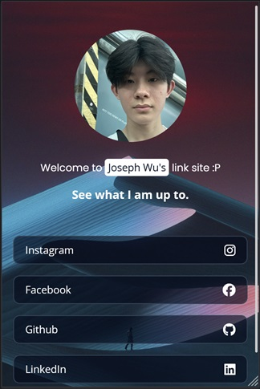

# Linktree Clone

## Introduction
This project is a simple replica of Linktree. It contains multiple links to various online destinations such as social media profiles.

## Features
- **Responsive Design**: The web application is designed to be responsive and accessible on various devices, including desktops, tablets, and mobile phones.
- **Social Media Links**: Integration with popular social media platforms such as Instagram, Facebook, Github, and LinkedIn.

## Technologies Used
- HTML5
- CSS3 (with Flex for layout)

## Screenshot

## Website
Visit the deployed website: [JosephIsCool](josephiscool.netlify.app)

## Acknowledgements
- Inspiration: Linktree (https://linktr.ee)
